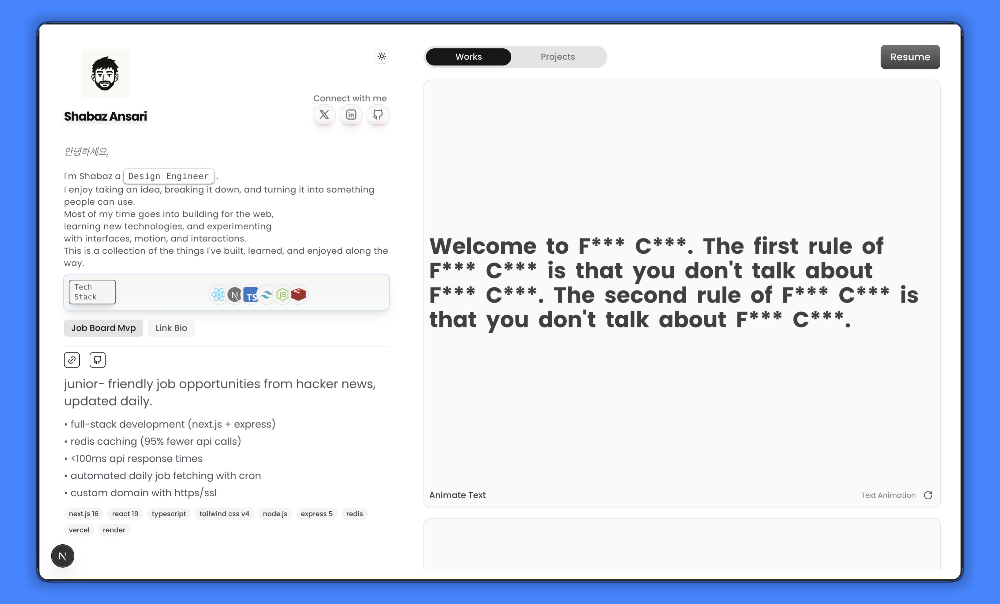

# Minimal Portfolio

A minimal, animation-rich developer portfolio built with Next.js and Motion.
Showcases **19 interactive UI prototypes and animation experiments** — from
magnetic buttons to 3D card transforms.

**Live Demo:** [Minimal Portfolio](https://minimal-portfolio-beta-mocha.vercel.app)

---

## About

Minimal Portfolio is my personal developer portfolio and frontend experimentation space.

The project includes interactive UI prototypes and animation experiments
built while learning and practicing modern React animation and interaction
patterns. Some components were inspired by tutorials, Motion primitives,
and existing UI patterns, then adapted and implemented for this project.

The portfolio also showcases projects I have built and deployed.

---

## Preview



[▶ Watch the interactive demo](https://github.com/user-attachments/assets/fc08d972-cdaa-4bca-a111-18442b5e3487)

---

## Tech Stack

| Category   | Technology              |
| ---------- | ----------------------- |
| Framework  | Next.js 16 (App Router) |
| Language   | TypeScript              |
| Styling    | Tailwind CSS v4         |
| Animation  | Motion                  |
| Icons      | Tabler Icons, Lucide    |
| Dark Mode  | next-themes             |
| Font       | Poppins (Google Fonts)  |
| Deployment | Vercel                  |

---

## Highlights

- **19 interactive UI prototypes** — blur-in text, 3D transforms, layout animations, spring physics, infinite sliders
- **Magnetic cursor** — spring-based button that follows the mouse
- **3D card transforms** — perspective rotateX/Z with hover and tap states
- **Layout animations** — shared layout transitions between states
- **Dark mode** — full light/dark theme with system preference detection
- **Mobile-ready** — `whileTap` effects for touch devices

---

## Features

### Animations

- Staggered text blur-in on scroll
- Multi-step purchase/submit button sequences
- Infinite vertical slider with album covers
- Text loop and flipper effects
- Orbital icon animation using CSS

### Interactions

- Magnetic cursor-following button
- macOS-style arc dock cards with drag-to-rearrange interactions
- Mouse-tracking radial gradient
- Hover-exit card reveal

### Layouts

- Layout-animated tab system with sliding pill indicator
- Avatar grid with expand/collapse transitions
- Auto-stacking cards with interval reveal
- Smooth navbar with hover indicator

### UI Components

- Profile sidebar with tech stack showcase
- Resume viewer with embedded PDF
- Project cards with video demos
- Theme toggle with icon rotation

---

## Getting Started

### Prerequisites

- Node.js 18+
- Bun (recommended) or npm

### Installation

Clone the repository:

```bash
git clone https://github.com/Kise07/Minimal-Portfolio.git
cd Minimal-Portfolio
```

Install dependencies:

```bash
bun install
```

### Development

Start the development server:

```bash
bun dev
```

Open <http://localhost:3000> in your browser.

### Production

Build the application:

```bash
bun build
```

Start the production server:

```bash
bun start
```

---

## Scripts

| Command                | Description                              |
| ---------------------- | ---------------------------------------- |
| `bun dev`              | Start the development server             |
| `bun build`            | Create a production build                |
| `bun start`            | Start the production server              |
| `bun run lint`         | Run ESLint                               |
| `bun run check-types`  | Type-check with TypeScript               |
| `bun run format`       | Format files with Prettier               |
| `bun run format:check` | Check formatting without modifying files |

Git hooks are configured with Husky and lint-staged to run checks on staged files before commits.

---

## Project Structure

```text
src/
├── app/                         # Application routes and layouts
├── components/
│   ├── core/                    # Layout primitives
│   ├── ui/                      # Profile, Works, cards, and UI components
│   ├── work/                    # Interactive animation demos
│   │   ├── animationSequence/   # Animation sequence components
│   │   ├── arc/                 # Dock cards
│   │   ├── features/            # Card effects
│   │   ├── layouts/             # Layout animations
│   │   ├── minimal/             # Buttons, sliders, and text effects
│   │   └── react-animations/    # 3D transforms and React animations
│   └── svgs/                    # Custom SVG icons
├── lib/                         # Shared utilities
└── ...
```

The project also uses a barrel `index.ts` to organize and export reusable animation components.

Static assets such as images, videos, and the project preview are stored in:

```text
public/
```

---

## Configuration

Key configuration files include:

- `next.config.ts` — Next.js configuration and image settings
- `tsconfig.json` — TypeScript configuration and path aliases
- `eslint.config.mjs` — ESLint configuration
- `prettier.config.*` — Prettier formatting configuration
- `components.json` — UI/component configuration

No environment variables are required to run the project locally.
